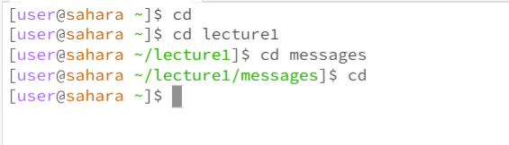
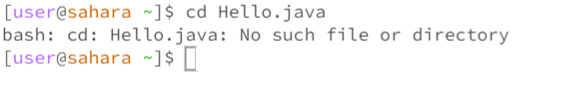
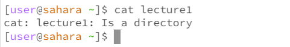

***Lab Report 1 (week 1)***

**`cd` Commands**

*Example 1*

In this I tried to do `cd` when I was in my `home` directory, it returned to me nothing so then I `cd` myself into `lecture1` then `cd `into `messages` and then I did `cd` with no arguments, and i found out `cd` with no arguments returns me to my `home` directory. (This was not an Erorr)

*Example 2*

Starting from my `home` directory I `cd` into `lecture1`, so i went from my `home` directory to `lecture1` directory.(Not an Error)

*Example 3*

From my `home` directory, I tried to `cd` into a file called `Hello.java`, it returned to me an error. This is because `Hello.java` is not a directory so I cannot use the command `cd` on that as its a file.

**`ls` Commands**

*Example 4*

From my `home` directory, I did `ls` and it returned to me my `LabReport.java` file I made as its own seperated file and my `lecture1` directory (Highlighted blue in the picture, since its a directory).                 (Not an Error)

*Example 5*

From my `home` directory, I did `ls` on my `lecture1` directory, it returned to me the files in that directory and the `messages` directory (highlighted blue just like `lecture1`).  (Not an Error)

*Example 6*

From the `lecture1` directory I used `ls` on the `Hello.java` file it returned to me all the files in that directory.(Not an Error)

**`cat` Commands**

*Example 7*

From my `home` directory I did cat with no arguments and it returned nothing so I did `ctrl + c` to return back.(Not an error) `cat` just uses an argument to know what to print out, otherwise it prints out nothing.

*Example 8*

From my `home` directory I did `cat` into the `lecture1` directory and got a error saying the command `cat` cannot be done on a directory. This is because `lecture1` is a directory so it cannot print out all the files, it must be specified what file.

*Example 9*

From the `lecture1` directory I did the `cat` command on the file `README`, doing so printed out everything in the `README` file. (Not an Error)

