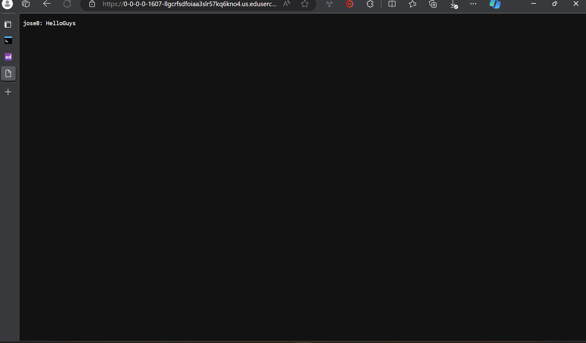
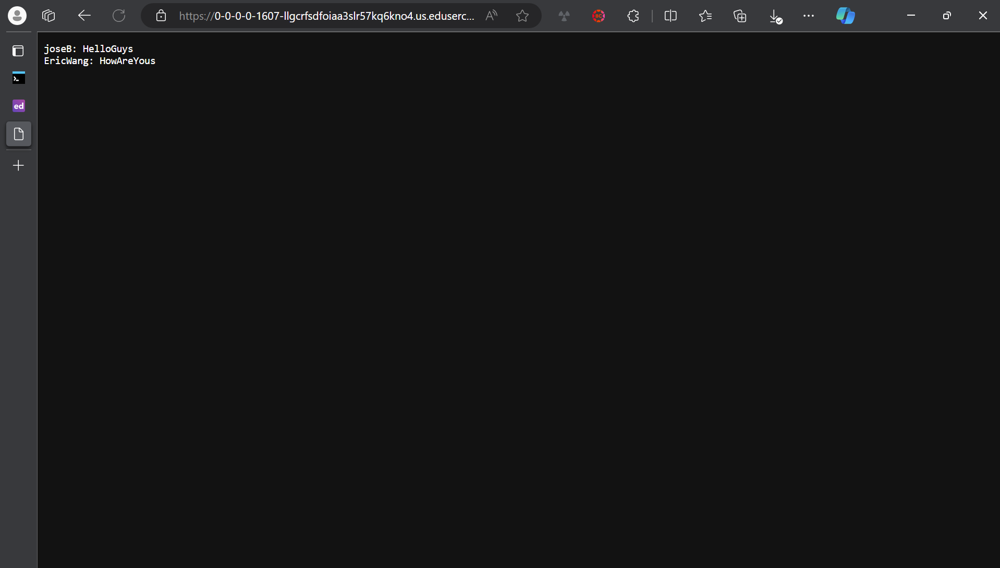
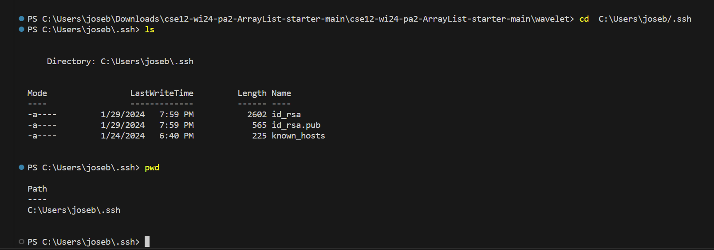
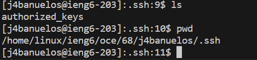
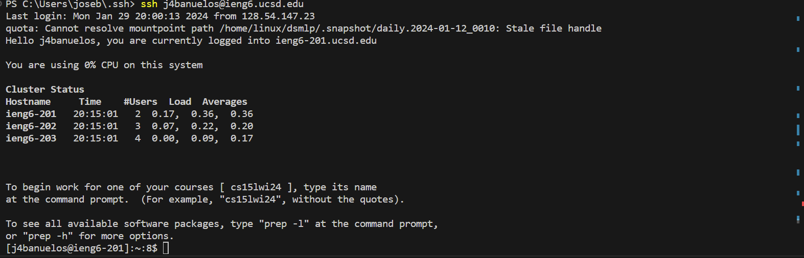

***Lab Report 2 (Week 3)***

My Code from the file `ChatServer.java`
```
import java.io.IOException;
 import java.net.URI;

 class Handler implements URLHandler {
    // The one bit of state on the server: a string that will be manipulated by
    // various requests.
    String chatHistory = "";

    public String handleRequest(URI url) {
        if (url.getPath().equals("/")) {
            return chatHistory.isEmpty() ? "No messages yet." : chatHistory;
        } else if (url.getPath().contains("/add-message")) {
            String query = url.getQuery();
            if (query != null) {
                String[] params = query.split("&");
                String user = "", message = "";
                for (String param : params) {
                    String[] pair = param.split("=");
                    if (pair[0].equals("user")) {
                        user = pair[1];
                    } else if (pair[0].equals("s")) {
                        message = pair[1];
                    }
                }

                if (!user.isEmpty() && !message.isEmpty()) {
                    chatHistory += user + ": " + message.replace("+", " ") + "\n";
                    return chatHistory;
                }
            }
            return "Invalid request!";
        } else {
            return "404 Not Found!";
        }
    }
}

class ChatServer {
    public static void main(String[] args) throws IOException {
        if (args.length == 0) {
            System.out.println("Missing port number! Try any number between 1024 to 49151");
            return;
        }

        int port = Integer.parseInt(args[0]);
        Server.start(port, new Handler());
    }
}
```

**Screenshot 1: LabReport2.1.png**



Which methods in your code are called?

The method `handleRequest(URI url)` from the `Handler` class is called.

Relevant arguments to those methods and the values of any relevant fields of the class:
The `url` argument stores the URL.
For the URL, the  path is `/add-message`, with query parameters `s=HelloGuys` and `user=joseB`.

`chatHistory` (before): The Server simply said `"Input String"`

How do the values of any relevant fields of the class change from this specific request?

The `chatHistory` field of the `Handler` class gets updated with the new message, resulting in a string like `joseB: HelloGuys\n.`

**Screenshot 2: LabReport2.png**



Which methods in your code are called?

Again, the method `handleRequest(URI url)` from the `Handler` class is called.

Relevant arguments to those methods and the values of any relevant fields of the class:
The `url` argument stores the URL.
For the URL, the path is `/add-message`, with query parameters `s=HowAreYou` and `user=EricWang`.
`chatHistory` (before): It would have been `joseB: HelloGuys\n` before this request.

How do the values of any relevant fields of the class change from this specific request?

The `chatHistory` field is updated by appending the new message from `EricWang`, which would result in `joseB: HelloGuys` and `\nEricWang: HowAreYou\n`.

**Public and Private Key**




Heres the path to the private key: `C:\Users\joseb/.ssh/id_rsa`



Absolute path to the public key `/home/linux/ieng6/oce/68/j4banuelos/.ssh/authorized_keys`

**Logging into `ieng6` without a password**




**What I Learned from Week 2 and Week 3 Labs**

In my labs Week 2 and week 3 I learned the `ssh` command for secure logins, also using `ieng6` and being surpised at how i could actually login with my ucsd user and password surpised me. I also learned the `scp` and `mkdir` commands, `scp` is a securely copy files and directories using `ssh` for the data transfer of the `file/directory`. `mkdir` stands for 'make directory' and you can even specify the path of it for example `mkdir /path/to/new_directory` by specifying the full path you choose where to make the directory. I also learned simple shortcuts I didnt know before, like in Vscode or edstem you dont have to retype in the terminal if youve typed it before, you simple use the up or down arrow. Another shortcut I learned is you can edit out a whole chunk of code by selecting it then pressing `ctrl + /`
