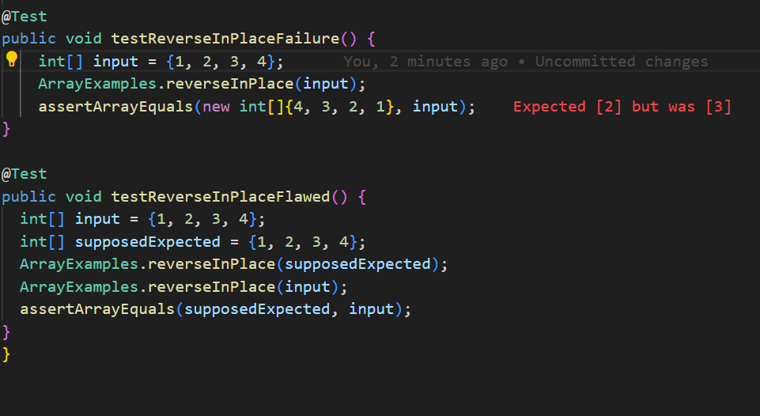
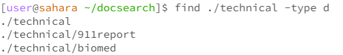
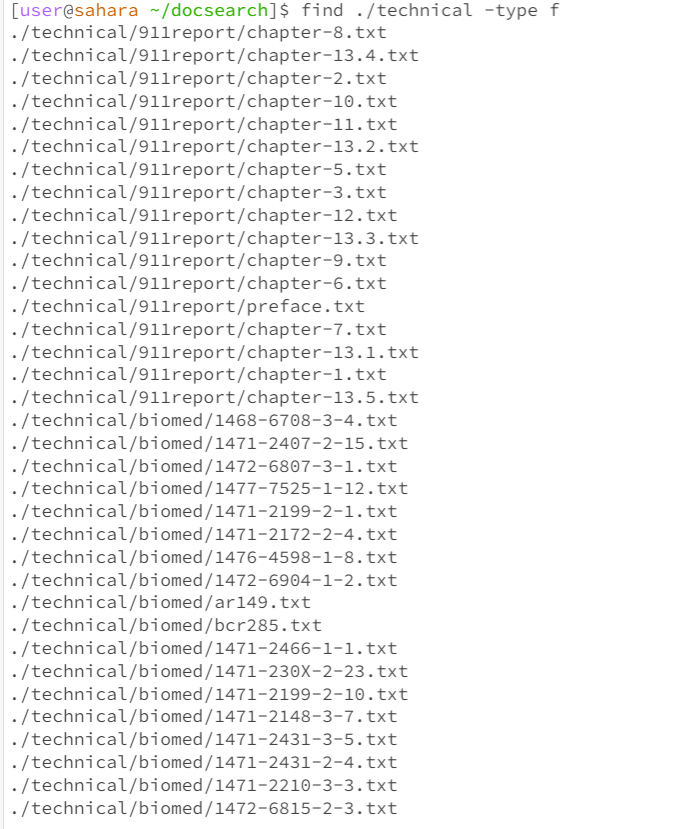
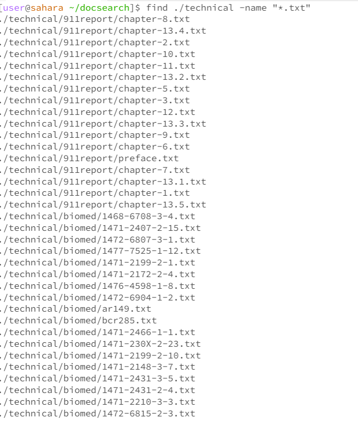
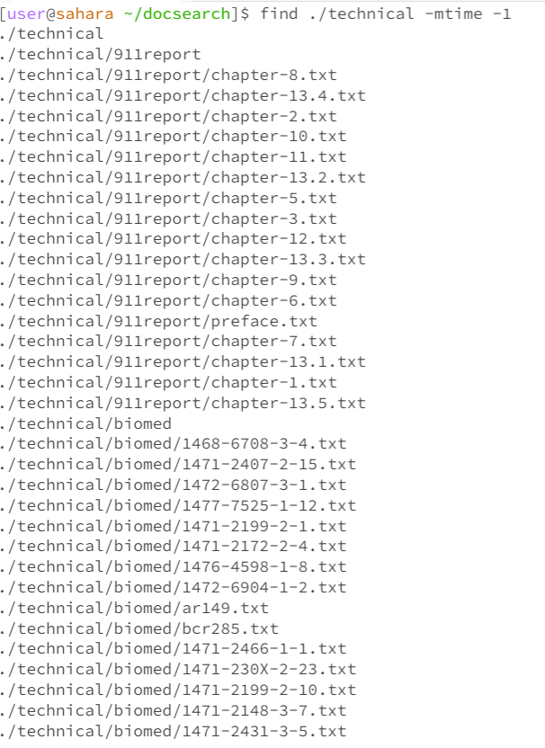
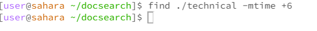
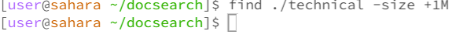
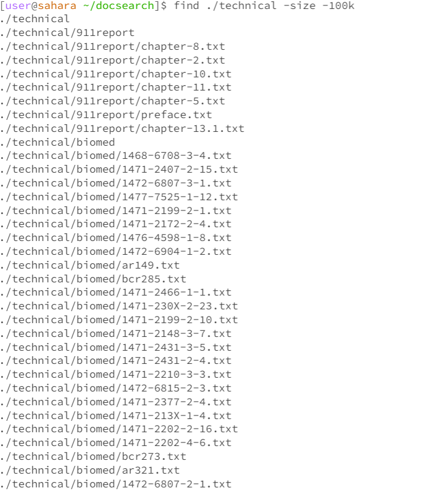

***Lab Report 3 (Week 5)***

**Bugs**

*A Test with a failure-inducing input for the buggy program*

```
@Test
public void testReverseInPlaceFailure() {
    int[] input = {1, 2, 3, 4};
    ArrayExamples.reverseInPlace(input);
    assertArrayEquals(new int[]{4, 3, 2, 1}, input);
}
```


*A Test with input that doesn't induce a failure, but has a bug*
```
@Test
public void testReverseInPlaceFlawed() {
  int[] input = {1, 2, 3, 4};
  int[] supposedExpected = {1, 2, 3, 4}; 
  ArrayExamples.reverseInPlace(supposedExpected); 
  ArrayExamples.reverseInPlace(input);
  assertArrayEquals(supposedExpected, input); 
}
```
*Why this test case is flawed:*  This test case is flawed because it uses the `reverseInPlace` method to generate the expected outcome (`supposedExpected`). If `reverseInPlace` does not work correctly, both input and `supposedExpected` will be incorrectly processed in the same way, making them equal by mistake and causing the test to pass.


*The symptom showed, as the output of running the tests*




*The bug, before*
```
public class ArrayExamples {
    public static void reverseInPlace(int[] array) {
        for(int i = 0; i < array.length / 2; i++) {
            int temp = array[i];
            array[i] = array[array.length - i];
            array[array.length - i] = temp;
        }
    }
}
```

*The Code Change Made after*
```
public class ArrayExamples {
    public static void reverseInPlace(int[] array) {
        for(int i = 0; i < array.length / 2; i++) {
            int temp = array[i];
            array[i] = array[array.length - i - 1]; // Subtract 1 to correct the index
            array[array.length - i - 1] = temp;
        }
    }
}
```
*Why this change works:*  The fix addresses the issue by correctly calculating the index of the element to swap with. In the original code, the index `array.length - i` is out of bounds when `i` is `0`. By adjusting the index to `array.length - i - 1`, we ensure we're accessing valid indices within the array, thereby correctly reversing the array in place.This change ensures that the first element swaps with the last, the second with the second-last, and so on, correctly reversing the array.

_____________________________________________________________________________________________________________________

**Researching Commands**
For my examples ive chosen the `find` command, the 4 examples I use are `-type`,`-name`, `-mtime`, `-size`

I did all my 8 examples From the `docsearch` directory as im using the find command on the `/technical` files

_____________________________________________________________________________________________________________________
*`-type` This option allows you to specify the type of file you're looking for. The common types include `f` for regular files and `d` for directories.*




The command returns all the directories in `/technical`.



The Command returns all the files in `/technical`.

_____________________________________________________________________________________________________________________

*`-name` Search for files by their name, supporting wildcards such as `*` for any characters.*



Returns all the files ending in `.txt`


Returns nothing as no file ends in `*config`

_____________________________________________________________________________________________________________________

*`-mtime`: Search for files modified within a specific time frame. The number represents days; `-mtime -1` means "modified within the last day."*




Returns all the files modified in the last 24 hours




We see nothing returned again as no file has not been modified in the last 7 days

_____________________________________________________________________________________________________________________

* `-size`: Locate files of a specific size. You can specify sizes in blocks (c for bytes, k for kilobytes, M for megabytes, and G for gigabytes).*





Nothing is returned as no file is larger than 1 megabyte



 
Finds and returns all the files in `/technical` that are less than 100 megabytes, a lot of files are returned as they are all `.txt` files and dont take much storage space.

_____________________________________________________________________________________________________________________

**Ciation for my sources**
Find Command in Linux (Find Files and Directories): [https://linuxize.com/post/how-to-find-files-in-linux-using-the-command-line/](https://linuxize.com/post/how-to-find-files-in-linux-using-the-command-line/)
