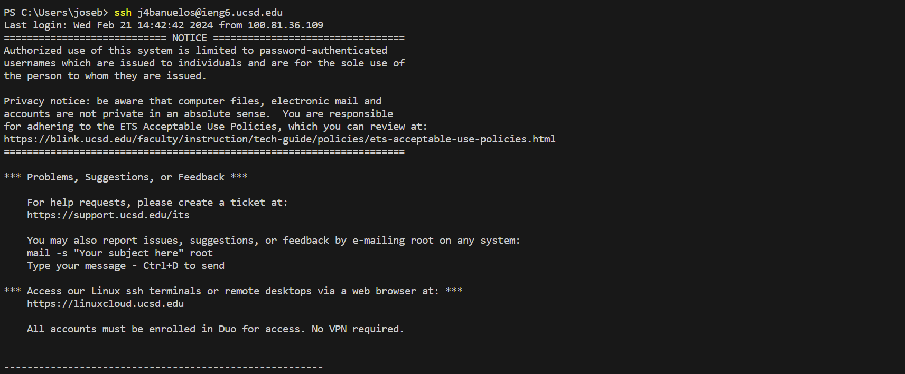
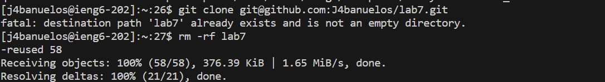
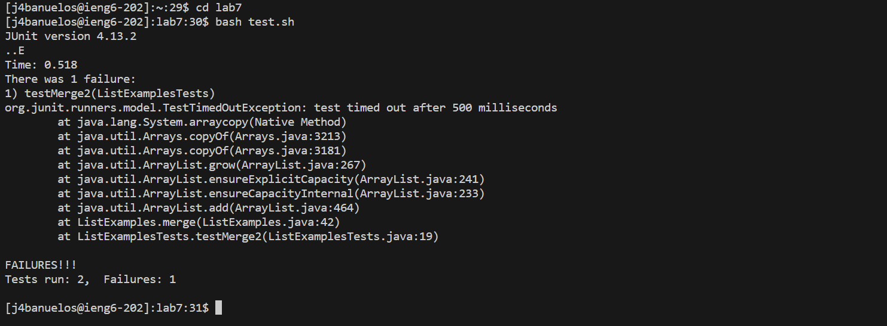
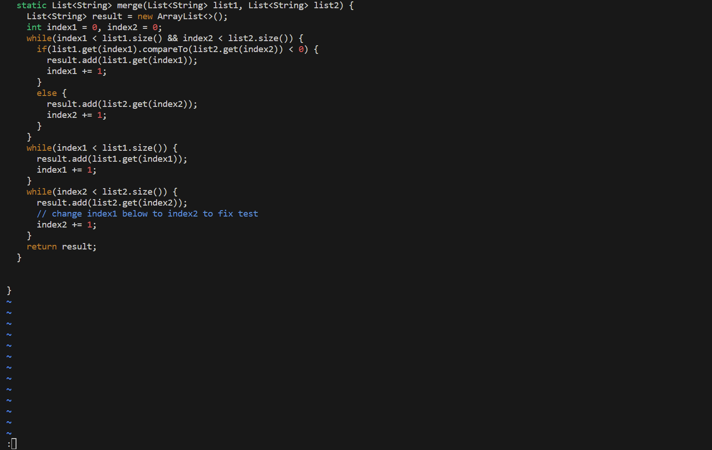
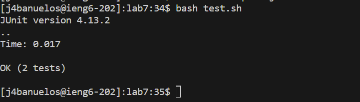
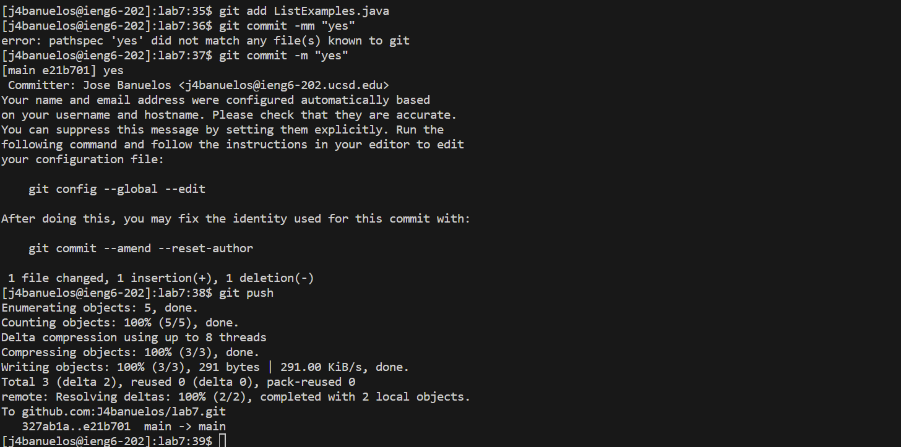

***CSE-15L Lab Report***

**Step 1**

logged into ieng6

Keys pressed: `ssh <space> j4banuelos@ieng6.ucsd.edu <enter> `

**Step 2**

Clone your fork of the repository from your Github account (using the SSH URL)

Keys Pressed: `git <space> clone <space> git@github.com:J4banuelos/lab7.git <enter>` 

First gave me an error of lab7 already exists and is not an empty directory so then I did 

Keys Pressed: `rm <space> -rf <space> lab7 <enter>`

This Fixed my error so then I did

Keys Pressed: `<up> <up> <enter>`

**Step 3**

Run the tests, demonstrating that they fail

 Keys Pressed: `cd <space> lab7 <enter>,` `bash <space> test.sh <enter>`

**Step 4**

Edit the code file to fix the failing test

First I enter Vim so

Keys pressed: `vim <space> ListExamples.java`

I then entered vim then did 

Keys Pressed: `44 shift G, e then r (hold it til you press desired key which you want replace character with) 1 tab :wq <enter>`

**Step 5**

Run the tests, demonstrating that they now succeed

Keys pressed: `bash <space> test.sh <enter>`

**Step 6**

Commit and push the resulting change to your Github account 

Keys pressed: `git <space> add <space> ListExamples.java <enter> git <space> commit <space> -m <space> "yes" <enter> git <space> push <enter>`

